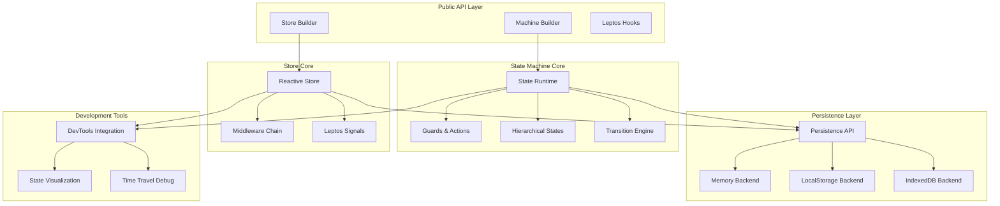

# Component Architecture Design - Leptos State

**Version**: 1.0  
**Date**: September 20, 2025  
**Status**: Design Review Required

## System Overview

Leptos State provides reactive state management through two primary paradigms:
1. **State Machines** (XState-inspired) - Finite state machines with guards and actions
2. **Reactive Stores** (Zustand-inspired) - Reactive data stores with Leptos signal integration

## Core Architecture



## Component Breakdown

### 1. State Machine Components

#### Machine Builder (`machine/builder.rs` - ~280 lines)
- **Responsibility**: Fluent API for defining state machines
- **Key Types**: `MachineBuilder<S, E>`, `StateBuilder<S>`, `TransitionBuilder<S, E>`
- **Dependencies**: Core state types, guard/action traits
- **API Surface**: Small, type-safe builder pattern

#### State Runtime (`machine/runtime.rs` - ~290 lines)  
- **Responsibility**: Execute state transitions, manage current state
- **Key Types**: `StateMachine<S, E>`, `StateContext`, `TransitionResult`
- **Dependencies**: Guards, actions, hierarchical states
- **Concurrency**: Thread-safe with interior mutability

#### Hierarchical States (`machine/hierarchical.rs` - ~285 lines)
- **Responsibility**: Nested states, parallel regions, entry/exit actions
- **Key Types**: `StateNode`, `StateGraph`, `ParallelRegion`
- **Dependencies**: Core state types, transition engine
- **Complexity**: High - handles state tree navigation

### 2. Reactive Store Components

#### Reactive Store (`store/reactive.rs` - ~250 lines)
- **Responsibility**: Zustand-style reactive state with Leptos integration
- **Key Types**: `ReactiveStore<T>`, `StoreConfig`, `UpdateFn<T>`
- **Dependencies**: Leptos signals, middleware system
- **Performance**: Optimized signal updates

#### Middleware Chain (`store/middleware.rs` - ~200 lines)
- **Responsibility**: Store update pipeline with logging, devtools, etc.
- **Key Types**: `Middleware<T>`, `MiddlewareChain`, `UpdateContext<T>`
- **Dependencies**: DevTools integration, logging
- **Extensibility**: Plugin-based architecture

### 3. Persistence Components

#### Persistence API (`persistence/mod.rs` - ~180 lines)
- **Responsibility**: Abstract persistence interface
- **Key Types**: `PersistenceBackend`, `PersistenceManager`, `PersistenceError`
- **Dependencies**: Serde for serialization
- **Design**: Backend-agnostic with async support

#### Memory Backend (`persistence/memory.rs` - ~150 lines)
- **Responsibility**: In-memory persistence for testing/development
- **Key Types**: `MemoryBackend`, `MemoryConfig`
- **Dependencies**: Thread-safe collections
- **Use Cases**: Testing, SSR, development

### 4. Development Tools

#### DevTools Integration (`devtools/mod.rs` - ~200 lines)
- **Responsibility**: Browser devtools integration
- **Key Types**: `DevToolsConfig`, `StateSnapshot`, `ActionLog`
- **Dependencies**: Web APIs, JSON serialization
- **Features**: Time travel, state inspection, action replay

## Component Interaction Patterns

### State Machine Flow
```
User Event → Guard Evaluation → Action Execution → State Transition → Signal Update → UI Re-render
```

### Store Update Flow  
```
Store Update → Middleware Chain → Signal Update → Subscriber Notification → UI Re-render
```

### Persistence Flow
```
State Change → Persistence Trigger → Backend Serialization → Storage Write → Recovery on Load
```

## Design Principles

### 1. Single Responsibility
- Each component handles one aspect of state management
- Clear boundaries between concerns
- Minimal cross-component dependencies

### 2. Type Safety
- Leverage Rust's type system for compile-time guarantees
- State and event types parameterized throughout
- No runtime type checks where compile-time is possible

### 3. Performance First
- Leptos signal integration optimized for minimal re-renders
- Lazy evaluation where possible
- Memory-efficient state representation

### 4. Developer Experience
- Fluent builder APIs for common use cases
- Clear error messages with actionable guidance
- Comprehensive DevTools integration

### 5. Extensibility
- Plugin-based middleware system
- Custom backend support
- Hook into all lifecycle events

## File Organization

```
leptos-state/src/
├── lib.rs                    # Public API re-exports
├── machine/                  # State machine implementation
│   ├── mod.rs               # Machine public API
│   ├── builder.rs           # Machine builder (~280 lines)
│   ├── runtime.rs           # Runtime engine (~290 lines)
│   ├── hierarchical.rs      # Nested states (~285 lines)
│   └── conditions/          # Guards and actions
│       ├── mod.rs
│       ├── guards.rs        # (~280 lines)
│       └── actions.rs       # (~280 lines)
├── store/                   # Reactive store implementation
│   ├── mod.rs               # Store public API  
│   ├── reactive.rs          # Core store (~250 lines)
│   └── middleware.rs        # Middleware system (~200 lines)
├── persistence/             # Persistence backends
│   ├── mod.rs               # Persistence API (~180 lines)
│   ├── memory.rs            # Memory backend (~150 lines)
│   ├── local_storage.rs     # LocalStorage backend (~200 lines)
│   └── indexed_db.rs        # IndexedDB backend (~250 lines)
├── devtools/                # Development tools
│   ├── mod.rs               # DevTools API (~200 lines)
│   └── visualization.rs     # State visualization (~250 lines)
└── utils/                   # Shared utilities
    ├── mod.rs
    └── serde_helpers.rs     # Serialization utils (~150 lines)
```

## Quality Gates

### Per Component Requirements
- [ ] Maximum 300 lines per file
- [ ] Single responsibility principle followed
- [ ] Comprehensive unit tests (>90% coverage)
- [ ] Documentation with examples
- [ ] Error handling with typed errors

### Integration Requirements  
- [ ] Contract tests between components
- [ ] Performance benchmarks
- [ ] Memory safety verification
- [ ] Thread safety analysis

### API Requirements
- [ ] Consistent naming conventions
- [ ] Backward compatibility strategy
- [ ] Deprecation path for breaking changes
- [ ] Semantic versioning compliance

This architecture provides a solid foundation for maintainable, performant state management while keeping components focused and testable.
